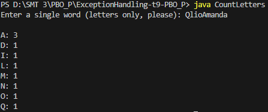
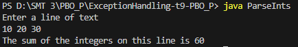
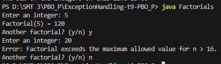

# Exception Handling - Pratikum 9 PBO

Repositori ini berisi kode sumber Java untuk **Pratikum 9: Penanganan Eksepsi (Exception Handling)**.

Proyek ini mendemonstrasikan cara menangani berbagai jenis error yang mungkin terjadi saat *runtime* agar program tidak berhenti secara mendadak (*crash*).

## 📂 Daftar Program & Screenshot

Berikut adalah rincian program yang ada dalam repositori ini:

### 1. CountLetters (ArrayIndexOutOfBoundsException)
Program ini menghitung frekuensi kemunculan huruf dalam sebuah kata.
- **Kasus Eksepsi:** Menangani error ketika membaca karakter yang bukan huruf (misalnya angka atau simbol), yang menyebabkan indeks array di luar batas.
> **Output:**
> 

### 2. ParseInts (NumberFormatException)
Program ini membaca satu baris teks dan menjumlahkan semua angka yang ada di dalamnya.
- **Kasus Eksepsi:** Menangani error ketika program mencoba mengubah teks (String) menjadi angka (Integer) tetapi formatnya bukan angka. Program akan melewati kata tersebut dan lanjut ke kata berikutnya.
> **Output:**
> 

### 3. Factorials & MathUtils (IllegalArgumentException)
Program untuk menghitung faktorial dari input pengguna.
- **Kasus Eksepsi:** Program melempar (*throw*) eksepsi kustom jika:
  1. Angka negatif (Faktorial tidak terdefinisi).
  2. Angka > 16 (Hasil melebihi kapasitas tipe data Integer).
> **Output:**
> 

---

## 🚀 Cara Menjalankan (How to Run)

Karena file-file ini tidak menggunakan `package`, bisa menjalankannya langsung dari dalam folder.

1.  **Buka Terminal** dan arahkan ke direktori folder ini:
    ```bash
    cd path/to/ExceptionHandling-t9-PBO_P
    ```

2.  **Compile Semua File:**
    Lakukan kompilasi untuk semua file Java sekaligus agar saling terhubung (terutama `Factorials` dan `MathUtils`).
    ```bash
    javac *.java
    ```

3.  **Jalankan Program:**
    Pilih program yang ingin dijalankan dengan perintah berikut:

    | Program | Perintah Run |
    | :--- | :--- |
    | **CountLetters** | `java CountLetters` |
    | **ParseInts** | `java ParseInts` |
    | **Factorials** | `java Factorials` |

---

## 👤 Identitas Pengirim

- **Nama** : Qlio Amanda Febriany
- **NIM** : 241511087
- **Kelas** : 2C
- **Prodi** : D3 Teknik Informatika
